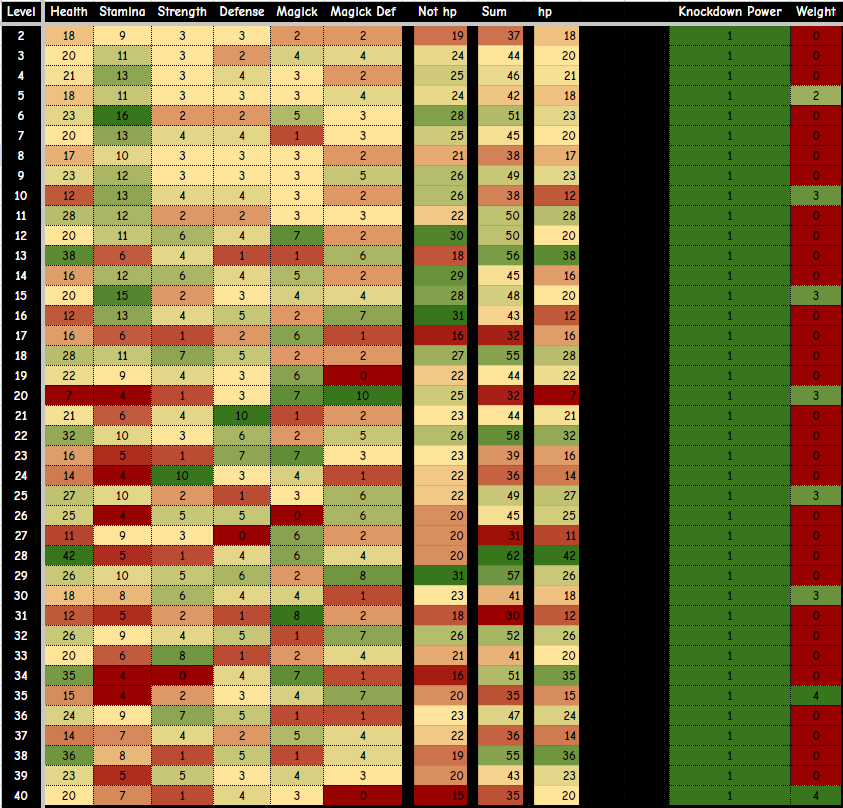

# Stat Growths

| Vocation         | Health | Stamina | Strength | Defense | Magick | Magick Def |
|:----------------:|:------:|:-------:|:--------:|:-------:|:------:|:----------:|
| Archer           | x1     | x1.2    | x1.2     | x1.2    | x0.8   | x0.8       |
| Fighter          | x1.4   | x1      | x1.3     | x1.3    | x0.6   | x0.6       |
| Mage             | x0.8   | x1      | x0.8     | x0.8    | x1.4   | x1.4       |
| Thief            | x0.9   | x1.3    | x1.2     | x1      | x0.8   | x1         |
|•|•|•|•|•|•|•|
| Mystic Spearhand | x1.2   | x1      | x1.2     | x0.9    | x1.2   | x0.9       |
| Magick Archer    | x1     | x1      | x0.9     | x0.9    | x1.4   | x1.2       |
| Sorcerer         | x0.8   | x1      | x0.7     | x0.7    | x1.6   | x1.5       |
| Trickster        | x1     | x1.1    | x1       | x1.1    | x1     | x1.2       |
| Warrior          | x1.5   | x1      | x1.5     | x1.2    | x0.6   | x0.5       |
| Warfarer         | x1     | x1      | x1       | x1      | x1     | x1         |

### Starting Stats

| Vocation | HP  | Stamina | Str | Def | Magick | Mag Def | KD-P | KD-Res | Weight |
| :-:      | :-: | :-:     | :-: | :-: | :-:    | :-:     | :-:  | :-:    | :-:    |
| Base     | 500 | 600     | 40  | 40  | 30     | 30      | 0    | 100    | 25     |
| Archer   | 500 | 650     | 45  | 40  | 30     | 30      | 20   | 70     | 25     |
| Fightr   | 650 | 600     | 55  | 50  | 10     | 15      | 20   | 100    | 30     |
| Mage     | 450 | 600     | 30  | 35  | 60     | 60      | 20   | 50     | 20     |
| Theif    | 500 | 700     | 50  | 40  | 30     | 30      | 20   | 50     | 25     |

## Stats When Vocation Equipped

| Vocation      | HP  | Stamina | Str | Def | Magick | Mag Def | KD-P | KD-Res | Weight |
| :-:           | :-: | :-:     | :-: | :-: | :-:    | :-:     | :-:  | :-:    | :-:    |
| Base          | 500 | 600     | 40  | 40  | 30     | 30      | 0    | 100    | 25     |
| Archer        | 0   | 50      | 5   | 0   | 0      | 0       | 20   | 30     | 0      |
| Fighter       | 150 | 0       | 15  | 10  | 20     | 15      | 20   | 0      | 5      |
| Mage          | 50  | 0       | 10  | 5   | 30     | 30      | 20   | 50     | 5      |
| Thief         | 0   | 100     | 10  | 0   | 0      | 0       | 20   | 50     | 0      |
| Mystic Spear  | 50  | 100     | 50  | 15  | 50     | 15      | 20   | 50     | 0      |
| Magick Archer | 0   | 200     | 40  | 40  | 40     | 30      | 20   | 50     | 0      |
| Sorcerer      | 200 | 0       | 20  | 15  | 60     | 40      | 20   | 50     | 5      |
| Trickster     | 100 | 100     | 100 | 50  | 0      | 50      | 20   | 50     | 5      |
| Warrior       | 350 | 0       | 60  | 20  | 40     | 40      | 20   | 300    | 10     |
| Warfarer      | 0   | 0       | 0   | 0   | 0      | 0       | 20   | 0      | 0      |

## Stat Data Lvl 2-40

| Level | Health | Stamina | Strength | Defense | Magick | Magick Def |
|-------|--------|---------|----------|---------|--------|------------|
| 2     | 18     | 9       | 3        | 3       | 2      | 2          |
| 3     | 20     | 11      | 3        | 2       | 4      | 4          |
| 4     | 21     | 13      | 3        | 4       | 3      | 2          |
| 5     | 18     | 11      | 3        | 3       | 3      | 4          |
| 6     | 23     | 16      | 2        | 2       | 5      | 3          |
| 7     | 20     | 13      | 4        | 4       | 1      | 3          |
| 8     | 17     | 10      | 3        | 3       | 3      | 2          |
| 9     | 23     | 12      | 3        | 3       | 3      | 5          |
| 10    | 12     | 13      | 4        | 4       | 3      | 2          |
| 11    | 28     | 12      | 2        | 2       | 3      | 3          |
| 12    | 20     | 11      | 6        | 4       | 7      | 2          |
| 13    | 38     | 6       | 4        | 1       | 1      | 6          |
| 14    | 16     | 12      | 6        | 4       | 5      | 2          |
| 15    | 20     | 15      | 2        | 3       | 4      | 4          |
| 16    | 12     | 13      | 4        | 5       | 2      | 7          |
| 17    | 16     | 6       | 1        | 2       | 6      | 1          |
| 18    | 28     | 11      | 7        | 5       | 2      | 2          |
| 19    | 22     | 9       | 4        | 3       | 6      | 0          |
| 20    | 7      | 4       | 1        | 3       | 7      | 10         |
| 21    | 21     | 6       | 4        | 10      | 1      | 2          |
| 22    | 32     | 10      | 3        | 6       | 2      | 5          |
| 23    | 16     | 5       | 1        | 7       | 7      | 3          |
| 24    | 14     | 4       | 10       | 3       | 4      | 1          |
| 25    | 27     | 10      | 2        | 1       | 3      | 6          |
| 26    | 25     | 4       | 5        | 5       | 0      | 6          |
| 27    | 11     | 9       | 3        | 0       | 6      | 2          |
| 28    | 42     | 5       | 1        | 4       | 6      | 4          |
| 29    | 26     | 10      | 5        | 6       | 2      | 8          |
| 30    | 18     | 8       | 6        | 4       | 4      | 1          |
| 31    | 12     | 5       | 2        | 1       | 8      | 2          |
| 32    | 26     | 9       | 4        | 5       | 1      | 7          |
| 33    | 20     | 6       | 8        | 1       | 2      | 4          |
| 34    | 35     | 4       | 0        | 4       | 7      | 1          |
| 35    | 15     | 4       | 2        | 3       | 4      | 7          |
| 36    | 24     | 9       | 7        | 5       | 1      | 1          |
| 37    | 14     | 7       | 4        | 2       | 5      | 4          |
| 38    | 36     | 8       | 1        | 5       | 1      | 4          |
| 39    | 23     | 5       | 5        | 3       | 4      | 3          |
| 40    | 20     | 7       | 1        | 4       | 3      | 0          |

## Single Peak Stats

|   Level | Peak Stat   | Peak %   | Best Vocation   |
|--------:|:------------|:---------|:----------------|
|       2 | Stamina     | 56.2%    | Thief           |
|       3 | Stamina     | 68.8%    | Thief           |
|       4 | Stamina     | 81.2%    | Thief           |
|       5 | Stamina     | 68.8%    | Thief           |
|       6 | Stamina     | 100.0%   | Thief           |
|       7 | Stamina     | 81.2%    | Thief           |
|       8 | Stamina     | 62.5%    | Thief           |
|       9 | Stamina     | 75.0%    | Thief           |
|      10 | Stamina     | 81.2%    | Thief           |
|      11 | Stamina     | 75.0%    | Thief           |
|      12 | Magick      | 87.5%    | Sorcerer        |
|      13 | Health      | 90.5%    | Warrior         |
|      14 | Stamina     | 75.0%    | Thief           |
|      15 | Stamina     | 93.8%    | Thief           |
|      16 | Stamina     | 81.2%    | Thief           |
|      17 | Magick      | 75.0%    | Sorcerer        |
|      18 | Strength    | 70.0%    | Warrior         |
|      19 | Magick      | 75.0%    | Sorcerer        |
|      20 | Magick Def  | 100.0%   | Sorcerer        |
|      21 | Defense     | 100.0%   | Fighter         |
|      22 | Health      | 76.2%    | Warrior         |
|      23 | Magick      | 87.5%    | Sorcerer        |
|      24 | Strength    | 100.0%   | Warrior         |
|      25 | Health      | 64.3%    | Warrior         |
|      26 | Magick Def  | 60.0%    | Sorcerer        |
|      27 | Magick      | 75.0%    | Sorcerer        |
|      28 | Health      | 100.0%   | Warrior         |
|      29 | Magick Def  | 80.0%    | Sorcerer        |
|      30 | Strength    | 60.0%    | Warrior         |
|      31 | Magick      | 100.0%   | Sorcerer        |
|      32 | Magick Def  | 70.0%    | Sorcerer        |
|      33 | Strength    | 80.0%    | Warrior         |
|      34 | Magick      | 87.5%    | Sorcerer        |
|      35 | Magick Def  | 70.0%    | Sorcerer        |
|      36 | Strength    | 70.0%    | Warrior         |
|      37 | Magick      | 62.5%    | Sorcerer        |
|      38 | Health      | 85.7%    | Warrior         |
|      39 | Health      | 54.8%    | Warrior         |
|      40 | Health      | 47.6%    | Warrior         |

## Tri Dominent Vocations With Peak Stats

| Lvl | Stat.1 | %.1 | V.1 | Stat.2 | %.2 | V.2 | Stat.3 | %.3 | V.3 | Stat.4 | %.4 | V.4 | Avg |
| :-: | :-: | :-: | :-: | :-: | :-: | :-: | :-: | :-: | :-: | :-: | :-: | :-: | :-: |
| 2 | Sta | 56.2% | Thief | Hp | 42.9% | War | Str | 30.0% | War | Def | 30.0% | Fight | War |   
| 3 | Sta | 68.8% | Thief | Mag | 50.0% | Sorc | Hp | 47.6% | War | MgD | 40.0% | Sorc | Sorc |  
| 4 | Sta | 81.2% | Thief | Hp | 50.0% | War | Def | 40.0% | Fight | Mag | 37.5% | Sorc | Thief |
| 5 | Sta | 68.8% | Thief | Hp | 42.9% | War | MgD | 40.0% | Sorc | Mag | 37.5% | Sorc | Sorc |  
| 6 | Sta | 100.0% | Thief | Mag | 62.5% | Sorc | Hp | 54.8% | War | MgD | 30.0% | Sorc | Sorc | 
| 7 | Sta | 81.2% | Thief | Hp | 47.6% | War | Str | 40.0% | War | Def | 40.0% | Fight | War |   
| 8 | Sta | 62.5% | Thief | Hp | 40.5% | War | Mag | 37.5% | Sorc | Str | 30.0% | War | War |    
| 9 | Sta | 75.0% | Thief | Hp | 54.8% | War | MgD | 50.0% | Sorc | Mag | 37.5% | Sorc | Sorc |  
| 10 | Sta | 81.2% | Thief | Str | 40.0% | War | Def | 40.0% | Fight | Mag | 37.5% | Sorc | Thief |
| 11 | Sta | 75.0% | Thief | Hp | 66.7% | War | Mag | 37.5% | Sorc | MgD | 30.0% | Sorc | Sorc |
| 12 | Mag | 87.5% | Sorc | Sta | 68.8% | Thief | Str | 60.0% | War | Hp | 47.6% | War | War |
| 13 | Hp | 90.5% | War | MgD | 60.0% | Sorc | Str | 40.0% | War | Sta | 37.5% | Thief | War |
| 14 | Sta | 75.0% | Thief | Mag | 62.5% | Sorc | Str | 60.0% | War | Def | 40.0% | Fight | Thief |
| 15 | Sta | 93.8% | Thief | Mag | 50.0% | Sorc | Hp | 47.6% | War | MgD | 40.0% | Sorc | Sorc |
| 16 | Sta | 81.2% | Thief | MgD | 70.0% | Sorc | Def | 50.0% | Fight | Str | 40.0% | War | Thief |
| 17 | Mag | 75.0% | Sorc | Hp | 38.1% | War | Sta | 37.5% | Thief | Def | 20.0% | Fight | Sorc |
| 18 | Str | 70.0% | War | Sta | 68.8% | Thief | Hp | 66.7% | War | Def | 50.0% | Fight | War |
| 19 | Mag | 75.0% | Sorc | Sta | 56.2% | Thief | Hp | 52.4% | War | Str | 40.0% | War | War |
| 20 | MgD | 100.0% | Sorc | Mag | 87.5% | Sorc | Def | 30.0% | Fight | Sta | 25.0% | Thief | Sorc |
| 21 | Def | 100.0% | Fight | Hp | 50.0% | War | Str | 40.0% | War | Sta | 37.5% | Thief | War |
| 22 | Hp | 76.2% | War | Sta | 62.5% | Thief | Def | 60.0% | Fight | MgD | 50.0% | Sorc | War |
| 23 | Mag | 87.5% | Sorc | Def | 70.0% | Fight | Hp | 38.1% | War | Sta | 31.2% | Thief | Sorc |
| 24 | Str | 100.0% | War | Mag | 50.0% | Sorc | Hp | 33.3% | War | Def | 30.0% | Fight | War |
| 25 | Hp | 64.3% | War | Sta | 62.5% | Thief | MgD | 60.0% | Sorc | Mag | 37.5% | Sorc | Sorc |
| 26 | MgD | 60.0% | Sorc | Hp | 59.5% | War | Def | 50.0% | Fight | Str | 50.0% | War | War |
| 27 | Mag | 75.0% | Sorc | Sta | 56.2% | Thief | Str | 30.0% | War | Hp | 26.2% | War | War |
| 28 | Hp | 100.0% | War | Mag | 75.0% | Sorc | MgD | 40.0% | Sorc | Def | 40.0% | Fight | Sorc |
| 29 | MgD | 80.0% | Sorc | Sta | 62.5% | Thief | Hp | 61.9% | War | Def | 60.0% | Fight | Sorc |
| 30 | Str | 60.0% | War | Sta | 50.0% | Thief | Mag | 50.0% | Sorc | Hp | 42.9% | War | War |
| 31 | Mag | 100.0% | Sorc | Sta | 31.2% | Thief | Hp | 28.6% | War | Str | 20.0% | War | War |
| 32 | MgD | 70.0% | Sorc | Hp | 61.9% | War | Sta | 56.2% | Thief | Def | 50.0% | Fight | Sorc |
| 33 | Str | 80.0% | War | Hp | 47.6% | War | MgD | 40.0% | Sorc | Sta | 37.5% | Thief | War |
| 34 | Mag | 87.5% | Sorc | Hp | 83.3% | War | Def | 40.0% | Fight | Sta | 25.0% | Thief | Sorc |
| 35 | MgD | 70.0% | Sorc | Mag | 50.0% | Sorc | Hp | 35.7% | War | Def | 30.0% | Fight | Sorc |
| 36 | Str | 70.0% | War | Hp | 57.1% | War | Sta | 56.2% | Thief | Def | 50.0% | Fight | War |
| 37 | Mag | 62.5% | Sorc | Sta | 43.8% | Thief | MgD | 40.0% | Sorc | Str | 40.0% | War | Sorc |
| 38 | Hp | 85.7% | War | Sta | 50.0% | Thief | Def | 50.0% | Fight | MgD | 40.0% | Sorc | War |
| 39 | Hp | 54.8% | War | Str | 50.0% | War | Mag | 50.0% | Sorc | Sta | 31.2% | Thief | War |
| 40 | Hp | 47.6% | War | Sta | 43.8% | Thief | Def | 40.0% | Fight | Mag | 37.5% | Sorc | War |

