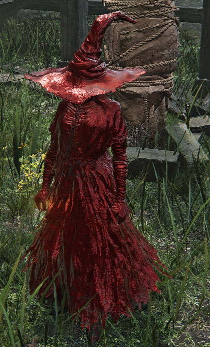

# Fire dmg w/ recluse: lvl 1 w/ flame sling

1. 157 [ +2 x 1] (9)
2. 155 [+1 x 1] (7)
3. 154 [ +0 x 1] (6)
4. 148 [ N/A] - Base

### One Buff

- **lvl 1**
- 123 base
- 128   + 0
- 129   + 1
- 131   + 2
---

- **lvl 15**
- 203 base
- 212 + 0
- 214 + 1
- 216 + 2

### Two Buffs
- **lvl 1**
- 134 + 0
- 139 + 2
---

- **lvl 15**
- 222 + 0
- 230 + 2

### Three Buffs
- **lvl 1**
- 148 + 2
---

- **lvl 15**
- 244 + 2

### DPS Test
- **lvl 1**
- magma R 153h 208e +2 x2
- magma R 156h 212e +sigil +hurt
- magma R 165h 225e +2 +hurt
-
- flame G 213 +2 x2
- flame G 224 +2 +giant
- flame G 241 +giant +hurt

---
- **lvl 15**
- magma R 253h 343e +2 x2
- magma R 247h 350e +sigil +hurt
- magma R 273h 371e +2 +hurt
-
- flame G 351 +2 x2
- flame G 370 +2 +giant
- flame G 398 +giant +hurt

