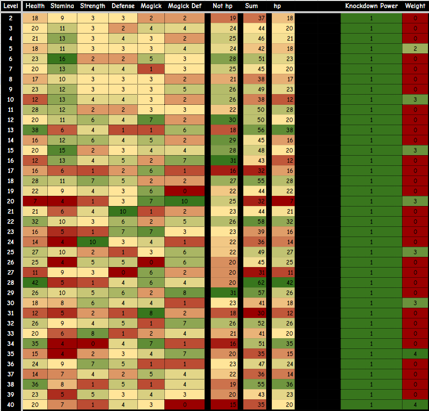

# Stat Growths

| Vocation         | Health | Stamina | Strength | Defense | Magick | Magick Def |
|:----------------:|:------:|:-------:|:--------:|:-------:|:------:|:----------:|
| Archer           | x1     | x1.2    | x1.2     | x1.2    | x0.8   | x0.8       |
| Fighter          | x1.4   | x1      | x1.3     | x1.3    | x0.6   | x0.6       |
| Mage             | x0.8   | x1      | x0.8     | x0.8    | x1.4   | x1.4       |
| Thief            | x0.9   | x1.3    | x1.2     | x1      | x0.8   | x1         |
|•|•|•|•|•|•|•|
| Mystic Spearhand | x1.2   | x1      | x1.2     | x0.9    | x1.2   | x0.9       |
| Magick Archer    | x1     | x1      | x0.9     | x0.9    | x1.4   | x1.2       |
| Sorcerer         | x0.8   | x1      | x0.7     | x0.7    | x1.6   | x1.5       |
| Trickster        | x1     | x1.1    | x1       | x1.1    | x1     | x1.2       |
| Warrior          | x1.5   | x1      | x1.5     | x1.2    | x0.6   | x0.5       |
| Warfarer         | x1     | x1      | x1       | x1      | x1     | x1         |

- Archer to 0-10 -> 
- Mage 11-12 -> 
- Fighter 13-18 -> 
- Mage 19-20 -> 
- Fighter 21-24 ->

